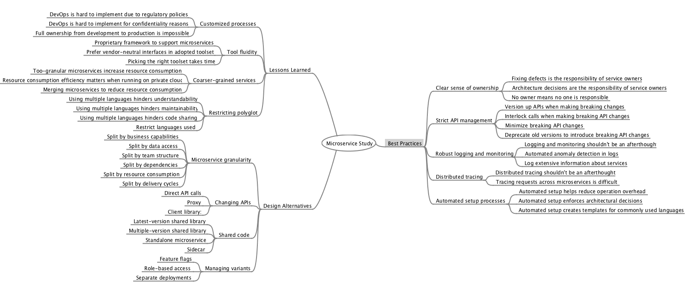

For open coding, two of the authors of the paper independently read the transcripts line by line and identified codes - _key ideas contained in data_. When looking for codes, we searched for the best phrase that describes conceptually what we believe is indicated by the raw data. On a weekly basis, all the authors met to discuss the identified concepts and to refine and merge them if needed. That was done using card sorting: each card represented a quote labeled with the codes, and we grouped the quotes and refined the codes, as needed. 

   

Conceptually similar codes were grouped together to form categories. Our mapping of codes -> concepts -> categories is below. Digial version can be downloaded [here](MicroserviceStudy.mm). We cannot publically share quotes not included in the paper at the moment due to confidentiality issues; we will reach out to the study participants and ask for their consent, and then update the map and the manuscript. 

